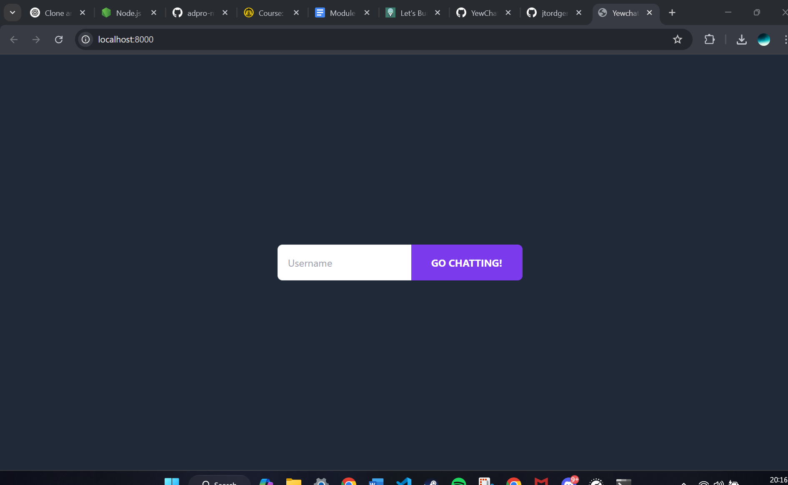
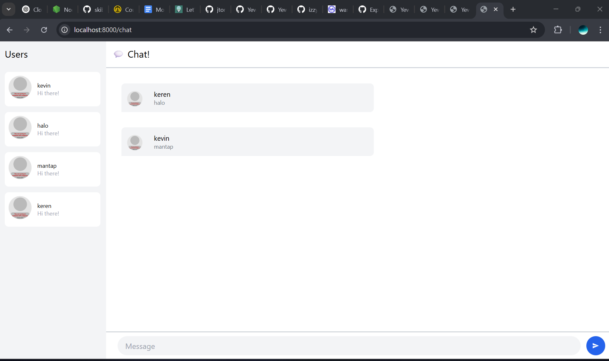
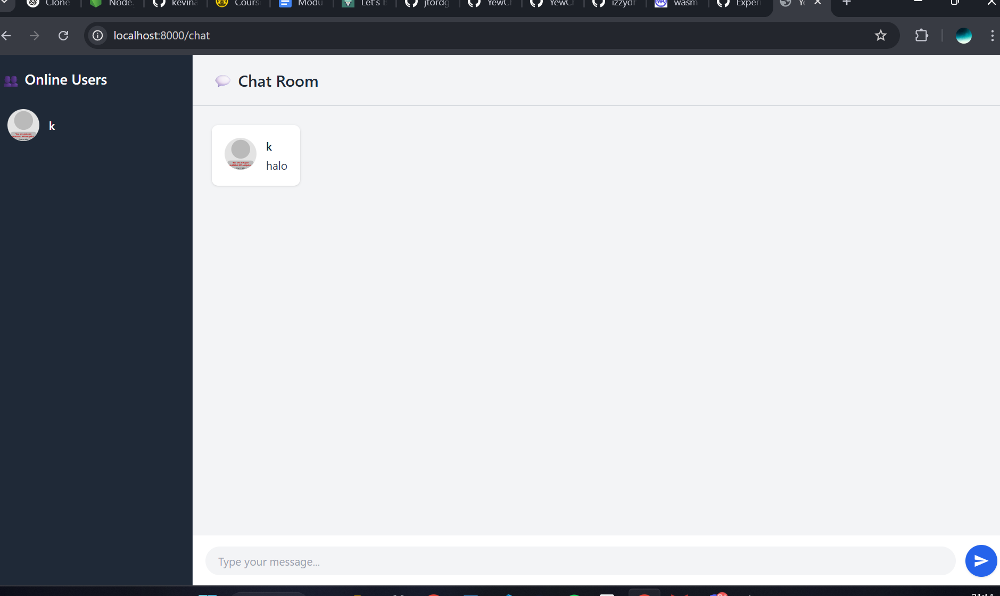

# YewChat 💬

> Source code for [Let’s Build a Websocket Chat Project With Rust and Yew 0.19 🦀](https://fsjohnny.medium.com/lets-build-a-websockets-project-with-rust-and-yew-0-19-60720367399f)

## Install

1. Install the required toolchain dependencies:
   ```npm i```

2. Follow the YewChat post!

## Branches

This repository is divided to branches that correspond to the blog post sections:

* main - The starter code.
* routing - The code at the end of the Routing section.
* components-part1 - The code at the end of the Components-Phase 1 section.
* websockets - The code at the end of the Hello Websockets! section.
* components-part2 - The code at the end of the Components-Phase 2 section.
* websockets-part2 - The code at the end of the WebSockets-Phase 2 section.

# Original code




# Be Creative


1. Sidebar Theme Updated
The sidebar (Online Users section) now uses a dark background (bg-gray-800) and white text (text-white) to create contrast and a modern look.

On hover, user entries highlight with a darker shade (hover:bg-gray-700), making it feel interactive.

2. Chat Room Background Enhanced
The entire background of the chat room is now a light gray (bg-gray-100), giving it a soft and clean appearance.

This makes the chat bubbles and input area stand out more clearly.

3. Message Bubble Styling Improved
Each message is placed in a white card (bg-white) with padding, rounded corners, and a subtle shadow using shadow, making it look like a speech bubble.

This visual separation helps users easily distinguish individual messages.

4. Chat Header Changed
The top chat room bar now uses a matching gray (bg-gray-100) with a bottom border (border-b border-gray-300), keeping it consistent with the rest of the UI.

5. Input Box Styling Updated
The message input box is now light gray (bg-gray-100), rounded like a modern input field, and highlights when focused using focus:ring-blue-500.

The send button is a bold blue (bg-blue-600) circle with a hover effect, giving it a clean and interactive look.